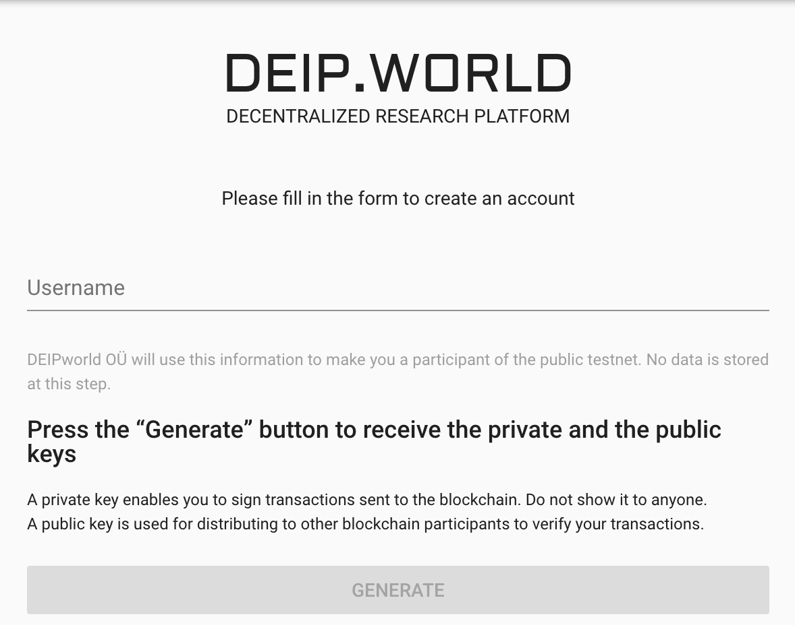
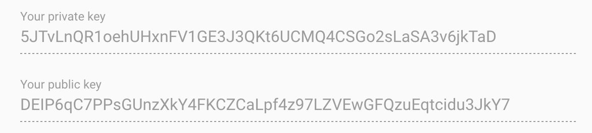
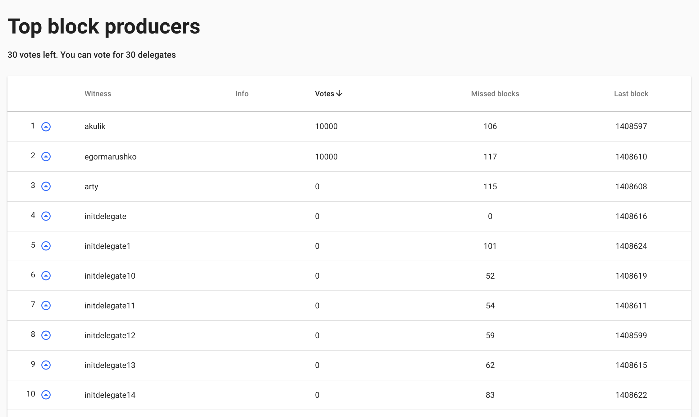

******
Faucet
******

`DEIP Faucet <https://faucet.deip.world/#/create-account>`_ application provides UI for account creation and voting for block producers.

Create account
--------------

The process is very straightforward and simple. All you need is to type in your username and generate keys. 

After you finish creating your account, you will be able to use your new account in the CLI wallet to test the DEIP blockchain.

.. Attention:: Make sure you saved the keys in a safe place and do not share it with any third parties! It is possible to recover the account, but it is better not to risk losing your account.

Vote for block producers
------------------------

You can use Faucet application to review list of all block producer candidates and vote for them.

Once you log in to Faucet application, navigate to *Block Producers* page.

You can vote for up to 30 block producer candidates.